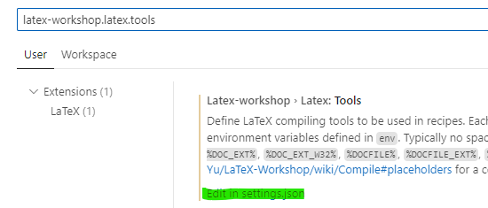
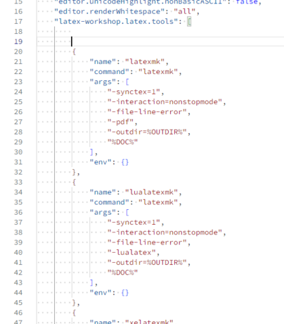
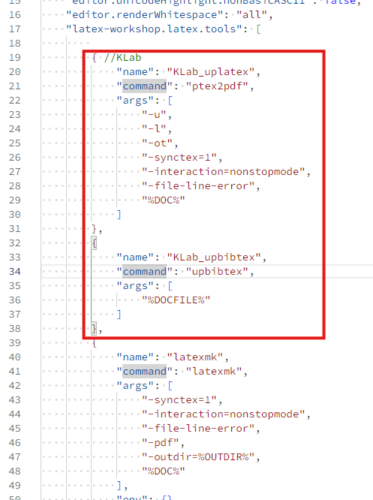
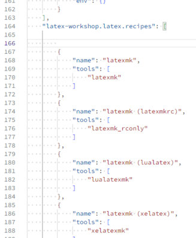
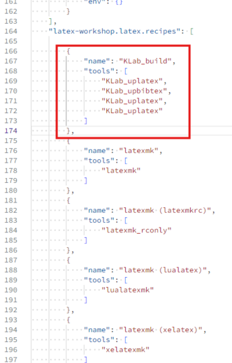
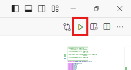
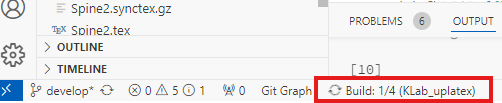

# 片山研究室 VScodeを用いたLaTeX環境構築指南

LaTeXは組版システムの一種であり、プログラムのように構造化された指示書と見た目を指定するスタイルファイルを基に文書を作成します。LaTeXはアカデミアにおける文書、つまりは論文などの執筆と非常に相性が良く、研究においては、ほぼ必須級のツールです。

本文書ではLaTeXのインストール方法と、Visual Studio Code上での編集環境の構築方法について説明します。

尚、LaTeXの記述方法についてはネットに腐る程転がっていますので、各々調べてください。

# 環境構築

環境構築の手法を説明します。

本文書では、以下のことを前提に進めます。

* Windows11環境
* Visual Studio Code(以後、VScode)がインストール済み

環境構築のために行うことを次に示します。

* TeX Liveをインストール
* VScodeに拡張機能「LaTeX Workshop」をインストール
* 「LaTeX Workshop」にLaTeXビルド用の設定を追加
* ビルドテスト

## TeX Liveをインストール

TeX LiveはTeXを使うための様々なツールやコンパイラ, ビルダーが入ったパッケージです。 
詳細・仕様：https://texwiki.texjp.org/?TeX%20Live

こちらをインストールしていただきます。手順は以下のリンク先の「ネットワークインストーラの場合」項からどうぞ。 
https://texwiki.texjp.org/?TeX%20Live%2FWindows#w369638d

## VScodeに拡張機能「LaTeX Workshop」をインストール
Visual Studio Codeの拡張機能検索から、「LaTeX Workshop」をインストールしてください。同名の拡張機能がいくつかある様ですが、James Yu氏が公開しているものを使います。 
https://marketplace.visualstudio.com/items?itemName=James-Yu.latex-workshop

## 「LaTeX Workshop」にLaTeXビルド用の設定を追加

さて、これが一番厄介です。
実はLaTeXのビルドは結構めんどくさく、一回のビルドのためにコンパイルを何度もしなければいけません。これをボタン１つでできるように設定するのが本項の目的です。

### 1. ビルド用ツールを登録する
一回一回のコンパイルをどのようにするのか...を指定するものです。

まず、VScodeの設定を開きます。 Ctrl + , で開きます。

検索窓に、「latex-workshop.latex.tools」と入力し、検索結果の下方にある「Edit in setting.json」をクリックします。

 "latex-workshop.latex.tools"に対し、以下を追記します。

    { //KLab
        "name": "KLab_uplatex",
        "command": "ptex2pdf",
        "args": [
            "-u",
            "-l",
            "-ot",
            "-synctex=1",
            "-interaction=nonstopmode",
            "-file-line-error",
            "%DOC%"
        ]
    },
    {
        "name": "KLab_upbibtex",
        "command": "upbibtex",
        "args": [
            "%DOCFILE%"
        ]
    },

追加前 

追加後 

setting.jsonは保存して閉じましょう。

### ビルドレシピを登録する

先程の設定検索窓に「latex-workshop.latex.recipes」と入力し、同じように「Edit in setting.json」をクリックします。

今度は以下のコードを追加します。

    {
        "name": "KLab_build",
        "tools": [
            "KLab_uplatex",
            "KLab_upbibtex",
            "KLab_uplatex",
            "KLab_uplatex"
        ]
    },

追加前 

追加後 

LaTeX Workshopは、上位のレシピをデフォルトで用いるため、必ず画像のように先頭に記述することに注意してください。
setting.jsonは保存して、閉じずに次へ進みます。

### 便利な設定

LaTeXはビルド時に一時的に使用するファイルを生成するが、ビルド終了時にそれらのファイルは残ることになる。ファイルが散らかるだけならまだ良いが、こいつら一時ファイルが残っているのお陰で次のビルドに失敗する事がある。なんと行儀悪い。

ということでこのファイルをビルド終了時に削除する設定を追加する。stting.jsonの最後の" } "の前に、以下を追加する。

また、ファイル保存時の自動ビルドを無効にしている。後述するが、片山研究室のLaTeXテンプレートは分割ファイルになっており、この分割ファイルと保存時自動コンパイルがすこぶる相性が悪いためである。

    "latex-workshop.latex.clean.fileTypes": [
        "*.aux", "*.bbl", "*.blg", "*.idx", "*.ind", "*.lof", "*.lot", "*.out", "*.toc", "*.acn", "*.acr", "*.alg", "*.glg", "*.glo", "*.gls", "*.ist", "*.fls", "*.log", "*.fdb_latexmk", "*.synctex.gz",
        // for Beamer files
        "_minted*", "*.nav", "*.snm", "*.vrb",
    ],
    "latex-workshop.latex.autoClean.run": "onBuilt"

    "latex-workshop.latex.autoBuild.run": "never"

## ビルドテスト

テンプレートファイルを用いて　ビルドテストを行う。

片山研究室のテンプレートファイルはセクションごとにTeXファイルが用意されており、最上位ディレクトリ直下にある main.tex によって統合される。この最上位ディレクトリ直下にある main.tex をビルドする必要があることに注意。

片山研究室LaTeXテンプレートのディレクトリをVScodeで開く。

最上位ディレクトリ直下にある main.tex をVScodeで展開し、画面右上のビルドボタンを押す。 

ビルドが始まる。進捗は画面左下から。レシピが "KLab_uplatex" になっていることを確認しておきましょう。 

進捗が✓になれば、ビルド完了。ディレクトリ内にPDFファイルがあるはずなので、開いて確認しましょう。

# 注意事項

* ファイル名に日本語が含まれるとビルドに転ける現象が報告されているので、半角英数で命名しましょう。
* LaTeXコンパイラのパスが正常に通っていないと，コンパイルに転ける可能性があります．コンパイラが見つからない実行できないなどのエラーが出た場合は，toolsにおける $command$ に，コンパイラの実行バイナリ(exe)の絶対パスを指定してください．

***
片山研究室 VScodeを用いたLaTeX環境構築指南 
2024年12月03日(火) 
R25SMP8 青山優希 
contact : yuuki.020925@gmail.com

初版：2025-11-25